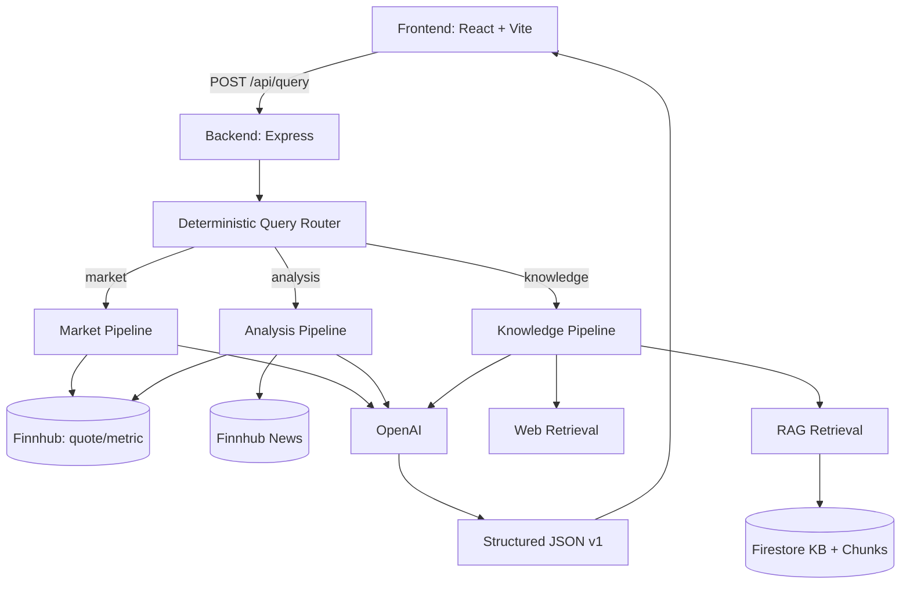
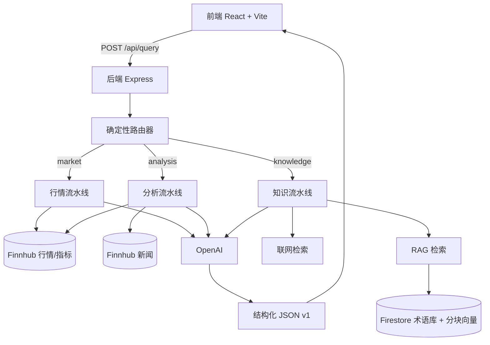

# FinAI — Financial Asset QA System

Full-stack LLM-powered financial QA system with deterministic routing, market data integration, RAG + web retrieval, and structured traceable responses.

<a id="top"></a>

<p>
  <a href="#english"><button>English</button></a>
  <a href="#中文"><button>中文</button></a>
</p>

---

<a id="english"></a>
## English

### Overview

FinAI provides:
- Asset market QA (price / trend / key metrics)
- Market movement analysis (metrics + recent news)
- Financial knowledge QA (Firestore glossary + vector retrieval + reranker)
- Open fallback with web retrieval when ticker and glossary both miss

The system is API-contract-first: frontend renders backend JSON; routing and data orchestration stay in backend pipelines.

### System Architecture



### Four Core Routing Scenarios

1. Stock + glossary hit -> market/analysis + RAG  
2. Stock only -> market/analysis only  
3. Glossary only -> RAG knowledge answer  
4. Neither -> open fallback + web retrieval (sources include `web_search`)

### Prompt Design (LLM guardrails)

- **Market prompt**: direct answer, only provided numbers, no speculation.
- **Analysis prompt**: combine metrics + news, acknowledge uncertainty if news is weak.
- **Knowledge prompt**: prioritize KB excerpts, cite `[KB-...]`; web snippets cite `[WEB-...]`.
- **Open fallback**: if no ticker/KB match, answer from web snippets with explicit uncertainty.

### Data Sources and Trust Strategy

- Market/fundamental data: Finnhub API.
- Knowledge base: Firestore (`financial_knowledge_base`, `financial_knowledge_chunks`).
- Web fallback: Wikipedia + DuckDuckGo retrieval chain.
- Anti-hallucination:
  - metrics are computed in backend (not by LLM),
  - strict response schema validation,
  - source attribution in every response,
  - trace steps + correlation id for debugging.

### Current Features (Aligned with plan)

- Deterministic router + LLM fallback classifier.
- Bilingual routing/recognition (EN + ZH keywords, symbol aliases).
- 1D / 5D / 30D trend metrics (`change_30d_pct` included).
- RAG vector retrieval + lexical reranker:
  - `0.75 * vector_similarity + 0.25 * lexical_score_norm`.
- Facts/analysis split in payload:
  - `facts` (objective block),
  - `analysis` (interpretive block),
  - with backward-compatible `summary`.
- Monitoring endpoints:
  - `GET /api/monitoring/pipeline` (JSON snapshot)
  - `GET /api/monitoring/dashboard` (lightweight HTML dashboard)

### API Contract (v1)

Main endpoint: `POST /api/query`

Response includes:
- `query_type`, `asset`
- `summary`, `facts`, `analysis`
- `key_metrics`, `chart_data`, `news`
- `sources`, `confidence`, `risk_note`
- `trace`, `correlation_id`

See exact schema: `shared/queryContract.ts`.

### Local Setup

1) Install dependencies:

```bash
npm install
cd frontend && pnpm install && cd ..
```

2) Configure root `.env`:

```bash
FINNHUB_API_KEY=...
OPENAI_API_KEY=...
LLM_MODEL=gpt-5.4-nano
LLM_TEMPERATURE=0.2
REQUEST_TIMEOUT_MS=10000
FIREBASE_PROJECT_ID=...
GOOGLE_APPLICATION_CREDENTIALS=/absolute/path/to/service-account.json
```

3) Seed and embed KB:

```bash
npm run rag:seed
npm run rag:embed
```

4) Run:

```bash
# terminal A
npm run server:dev

# terminal B
cd frontend
pnpm dev
```

Open `http://localhost:8080`.

### Security Note

- Never commit `.env`, service account keys, or credentials.
- `.gitignore` blocks env files and common secret key patterns.
- If any secret is exposed, rotate/revoke immediately.

### Optimization & Extension Ideas

- Add stronger search providers (SerpAPI/Brave/Tavily) for higher web recall.
- Persist monitoring metrics to TSDB for long-term dashboards.
- Add end-to-end tests for bilingual mixed-query flows.

### Demo Video

- 3-minute walkthrough (replace placeholder): [Demo Video](https://example.com/finai-demo)

[Back to top](#top)

---

<a id="中文"></a>
## 中文

### 项目简介

FinAI 是一个全栈金融问答系统，支持：
- 资产行情问答（价格/趋势/关键指标）
- 涨跌原因分析（行情 + 新闻）
- 金融知识问答（Firestore 术语库 + 向量检索 + 重排）
- 当“无股票且无术语”时的联网检索兜底

系统采用“契约优先”设计：前端只负责渲染结构化 JSON，业务路由与数据编排由后端统一处理。

### 系统架构



### 四种核心路由场景

1. 有股票 + 有术语 -> 行情/分析 + RAG  
2. 只有股票 -> 只走行情/分析  
3. 只有术语 -> 只走 RAG 知识回答  
4. 两者都没有 -> 开放式兜底 + web retrieval（sources 含 `web_search`）

### Prompt 设计要点

- **行情问答**：只使用给定数值，禁止编造。
- **分析问答**：结合行情与新闻，证据不足时明确不确定性。
- **知识问答**：优先引用术语库，使用 `[KB-...]`；网页补充引用 `[WEB-...]`。
- **开放兜底**：无股票/术语命中时，基于 web snippets 进行审慎回答。

### 数据来源与可信策略

- 行情与基本面：Finnhub API。
- 知识库：Firestore（`financial_knowledge_base`、`financial_knowledge_chunks`）。
- 联网兜底：Wikipedia + DuckDuckGo 级联检索。
- 防幻觉策略：
  - 指标由后端计算，LLM 仅做总结/解释；
  - 严格契约校验；
  - 全量来源透出；
  - 返回 `trace` 与 `correlation_id` 便于排查。

### 当前实现能力（与 plan 对齐）

- 确定性路由 + LLM 分类兜底。
- 中英文双语识别（关键词 + 公司别名/ticker 提取）。
- 1D/5D/30D 指标（包含 `change_30d_pct`）。
- 向量检索 + 规则重排：
  - `0.75 * vector_similarity + 0.25 * lexical_score_norm`。
- 响应拆分为：
  - `facts`（客观信息块）
  - `analysis`（解释信息块）
  - 兼容 `summary`。
- 监控接口：
  - `GET /api/monitoring/pipeline`
  - `GET /api/monitoring/dashboard`

### 接口契约（v1）

主接口：`POST /api/query`

返回字段包含：
- `query_type`, `asset`
- `summary`, `facts`, `analysis`
- `key_metrics`, `chart_data`, `news`
- `sources`, `confidence`, `risk_note`
- `trace`, `correlation_id`

精确 schema 见：`shared/queryContract.ts`。

### 本地运行

1）安装依赖：

```bash
npm install
cd frontend && pnpm install && cd ..
```

2）配置根目录 `.env`：

```bash
FINNHUB_API_KEY=...
OPENAI_API_KEY=...
LLM_MODEL=gpt-5.4-nano
LLM_TEMPERATURE=0.2
REQUEST_TIMEOUT_MS=10000
FIREBASE_PROJECT_ID=...
GOOGLE_APPLICATION_CREDENTIALS=/absolute/path/to/service-account.json
```

3）初始化术语库：

```bash
npm run rag:seed
npm run rag:embed
```

4）启动服务：

```bash
# 终端A
npm run server:dev

# 终端B
cd frontend
pnpm dev
```

打开 `http://localhost:8080`。

### 安全说明

- 不要提交 `.env`、service account、密钥文件。
- 仓库已配置 `.gitignore` 保护常见敏感文件模式。
- 如密钥暴露，请立即轮换/吊销。

### 后续优化方向

- 替换为更高召回的 web provider（如 SerpAPI/Brave/Tavily）。
- 监控指标落地到时序库，形成长期可视化。
- 增加中英文混合查询的端到端自动化测试。

### 演示视频

- 3分钟演示链接（提交前替换占位符）：[Demo Video](https://brown.zoom.us/rec/share/H8QEP89x4hEHI78iFtzOTHWwI91iNyIyO8D1tBqC9gmOVmq_DZ3Ob6IrKUC1FIpD.6D7R1UsWA_nNsNCM?startTime=1774937068000)

[返回顶部](#top)
