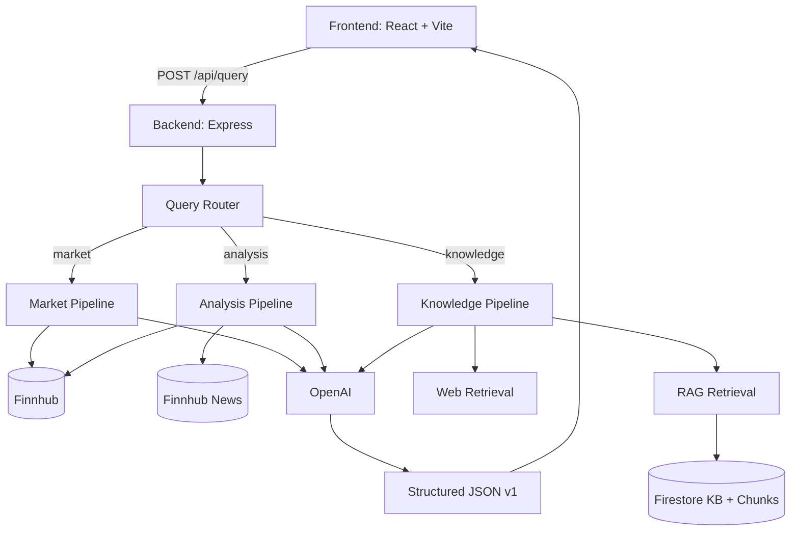

# FinAI - Financial Asset QA System / 金融资产问答系统

Full-stack LLM-powered financial QA application with deterministic routing, market data integration, RAG glossary retrieval, and structured traceable responses.  
一个全栈金融问答系统，支持确定性路由、行情数据接入、RAG术语检索与可追踪的结构化响应。

## Overview / 项目概览

- **Goal / 目标**: answer asset price/trend questions, explain movement causes, and provide glossary-grounded financial knowledge.
- **Core principle / 核心原则**: objective facts come from APIs/KB, while LLM focuses on summarization and explanation.
- **Contract-first / 契约优先**: frontend renders backend JSON contract and avoids business-logic branching.

## System Architecture / 系统架构



## Four-Scenario Routing / 四象限路由逻辑

1. **Stock + Glossary / 有股票 + 有术语**  
   - Run market/analysis pipeline **and** RAG retrieval.
2. **Stock only / 只有股票**  
   - Run market/analysis pipeline only.
3. **Glossary only / 只有术语**  
   - Run knowledge answer with RAG context.
4. **Neither / 两者都没有**  
   - Run open fallback with web retrieval and include web sources.

## Tech Stack / 技术栈

- **Frontend**: React, Vite, TypeScript, Tailwind, Firebase Auth/Firestore client
- **Backend**: Node.js, Express, TypeScript, Zod
- **LLM**: OpenAI Chat Completions
- **Market data**: Finnhub (`quote`, `stock/metric`, `company-news`)
- **Knowledge data**: Firebase Firestore (`financial_knowledge_base`, `financial_knowledge_chunks`)
- **Testing**: Node test runner (`tsx --test`) + TypeScript checks

## Prompt Design / Prompt设计思路

- **Market prompt / 行情问答**: answer directly using provided metrics only; no speculative numbers.
- **Analysis prompt / 分析问答**: combine metrics and news; cite uncertainty when evidence is weak.
- **Knowledge prompt / 知识问答**: prioritize KB terms and cite `[KB-...]`; supplement with `[WEB-...]` when needed.
- **Open fallback / 开放式兜底**: if no ticker/KB match, answer cautiously from web snippets with citations.

## Data Sources and Trust Strategy / 数据来源与可信策略

- **Objective data / 客观数据**: `key_metrics`, `news`, and source metadata are retrieved from APIs/Firestore.
- **Controlled generation / 受控生成**: LLM does not fetch market data; it summarizes/explains provided context.
- **Traceability / 可追踪性**: each response includes `trace` steps and `correlation_id`.
- **Source transparency / 来源透明**: `sources` includes `market_api`, `news_api`, `financial_knowledge_base`, `web_search`, and router metadata.

## API Contract (v1) / 接口契约（v1）

`POST /api/query` returns structured JSON including:

- `query_type`, `asset`
- `summary`, `facts`, `analysis`
- `key_metrics` (including `change_30d_pct`)
- `chart_data`, `news`, `sources`
- `confidence`, `risk_note`
- `trace`, `correlation_id`

See `shared/queryContract.ts` for exact schema.

## Local Setup / 本地运行

### 1) Install dependencies / 安装依赖

```bash
npm install
cd frontend && pnpm install && cd ..
```

### 2) Configure environment / 配置环境变量

Create `.env` in project root:

```bash
FINNHUB_API_KEY=...
OPENAI_API_KEY=...
LLM_MODEL=gpt-5.4-nano
LLM_TEMPERATURE=0.2
REQUEST_TIMEOUT_MS=10000

FIREBASE_PROJECT_ID=...
GOOGLE_APPLICATION_CREDENTIALS=/absolute/path/to/service-account.json
```

### 3) Seed and embed glossary / 初始化术语库与向量

```bash
npm run rag:seed
npm run rag:embed
```

### 4) Start services / 启动前后端

Terminal A (backend):

```bash
npm run server:dev
```

Terminal B (frontend):

```bash
cd frontend
pnpm dev
```

Open `http://localhost:8080`.

## Scripts / 常用命令

- `npm run server:dev` - backend dev server
- `npm run check` - type check (backend/shared)
- `npm run test` - backend tests
- `npm run rag:seed` - seed glossary to Firestore
- `npm run rag:embed` - build chunk embeddings
- `cd frontend && pnpm dev` - frontend dev server
- `cd frontend && pnpm typecheck` - frontend type check

## Monitoring / 监控

- `GET /api/monitoring/pipeline`: JSON snapshot (error rate/latency by query type)
- `GET /api/monitoring/dashboard`: lightweight HTML dashboard

## Evaluation Alignment / 与作业要求对齐

- **Frontend engineering**: interactive chat UI, history/saved sessions, source badges
- **Backend architecture**: deterministic router + explicit pipeline orchestration
- **LLM integration**: prompt-constrained generation with multi-context inputs
- **RAG quality**: vector retrieval + lexical reranker + source citation
- **Data reliability**: external APIs + trace/debug fields + uncertainty notes

## Security Note / 安全说明

- Never commit `.env` or credential files.
- `.gitignore` already blocks env files and common key formats.
- If a secret was exposed, rotate/revoke it immediately.

## Optimization & Extension Ideas / 优化与扩展思考

- Replace/augment web provider with higher-recall search APIs.
- Add online reranker or hybrid retrieval feedback loop.
- Persist monitoring metrics to TSDB (Prometheus/Grafana style dashboards).
- Add e2e tests for bilingual mixed-query routing.

## Demo Video / 演示视频

- 3-minute walkthrough (replace placeholder): [Demo Video](https://example.com/finai-demo)

## Repository Status / 交付状态

- Remaining checklist and progress are tracked in `plan.md`.
